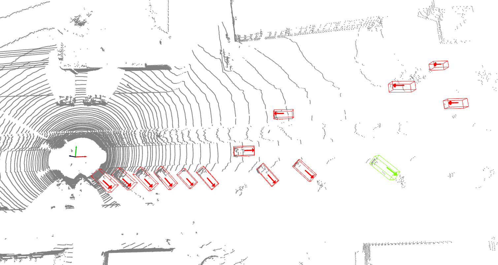

# open3d kitti visualization

kitti training data visiualization with [open3d](http://www.open3d.org/)

## Visualization




## Dataset preparation
Download KITTI dataset and create some directories first:

```plain
└── KITTI_DATASET_ROOT
       ├── training    <-- 7481 train data
       |   ├── image_2 <-- for visualization
       |   ├── calib
       |   ├── label_2
       |   ├── velodyne
       |   └── velodyne_reduced <-- empty directory
       └── testing     <-- 7580 test data
           ├── image_2 <-- for visualization
           ├── calib
           ├── velodyne
           └── velodyne_reduced <-- empty directory
```


## Demo
```
$ python visiualize.py
```

If you has your own data path, you  can run like this:
```
$ python visiualize.py --data=KITTI_DATASET_ROOT --frame=500
```
